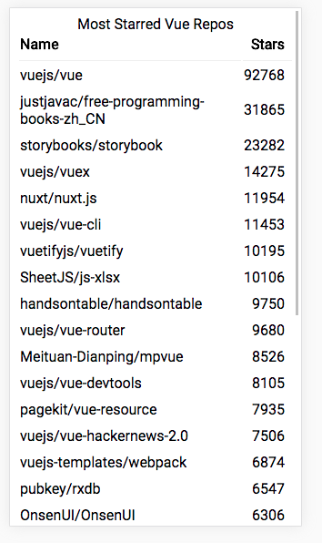
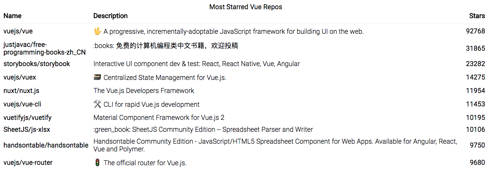

# VueFinder

This is a micro-React application that fetches the most popular Vue repositories from the GitHub Search API and renders them in order descending order of ⭐️. It was built with Create-React-App.



## Installation

Clone this repo:
```
$ git clone path/to/repo
```
Change into the directory and install dependencies:
```
$ cd VueFinder
$ npm install
```
`yarn` will also install dependencies.

Start the dev server:
```
$ npm run start
```
Run the tests:
```
$ npm run test
```

## Approach
The solution uses a single React component that manages its own state, to render a table of popular Github repos. Redux was not used, as it felt like 'overkill' for this task.

Instead, the call to the Github API was made through the 'componentDidMount' lifecycle function and refactored into a separate service. This is intended to make testing easier and improve clarity of the code structure.

The simple styling is mobile-first and adapts to displays of tablet width or greater.

Accessibility is observed by using the most appropriate HTML elements (i.e. `<table />, <caption/>`) rather than `<div/>`s. The text is of size readable on small phones and the displayed content adapts depending on width of the viewport.

## <a name='honesty'></a>Honesty up front
Although I made the majority of the app in the time, I hit a fantastically large roadbump in testing the 'componentDidMount' functionality. I was attempting to use `Enzyme` to generate a wrapper than could be updated with a `setTimeout` function and given a mocked function and stubbed data, could check that the number of table rows rendered were correct.

This ran into the issue mentioned [here](https://facebook.github.io/jest/docs/en/troubleshooting.html#unresolved-promises), where an unresolved promise is throwing a Timeout error. I need to bang my head against the `Jest` docs, get a Stack-Overflow post up or hassle someone in their chat until I solve this one.

## Testing
Testing is achieved with the `Jest` test runner and library, `Enzyme` and at some points, with `Sinon` (see [Honesty Up Front](#honesty)).

Using the `Jest` documentation on async testing, I created a mock function and fake data to test the componentDidMount function. The approach is outlined [here](https://facebook.github.io/jest/docs/en/tutorial-async.html)

## Improvements
- Get the broken test working. It checks the main functionality of the app
- Add better protection for API responses that are not `200`, rather than a `catch` block that offers the user no feedback.
- Allow the user to input the search parameters (e.g. search for other popular languages etc)
- Place sorting into the UI and the hands of the user, rather than using the Github api to sort the data.

## Lessons
I used this as an opportunity to learn the basics of [Redux-Sagas](https://redux-saga.js.org/docs/introduction/BeginnerTutorial.html), as Sagas are (I've heard) great to test in comparison the pain of testing `thunks`. Sagas were overkill for this, but it wouldn't take a very large app to make them worthwhile using.

Time
